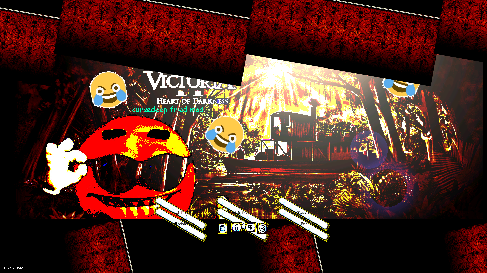
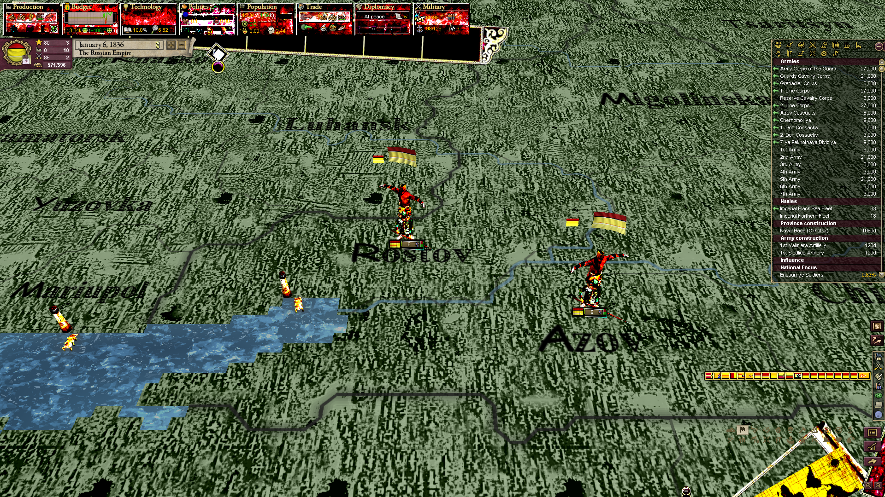

# Victoria 2 Cursed Mod
A Victoria 2 mod that makes the game more cursed. This mod changes the graphics of the game to make it nice and crispy, adding emojis, and generally making for a more cursed experience overall.
 

This mod is also on [ModDb](https://www.moddb.com/mods/cursed-deep-fried).
 
## Installation instructions:

Latest official release:

1. Download the mod by clicking [here](https://github.com/s-williams/Victoria-2-Cursed/releases), find the latest release and download the asset called Cursed-x.zip (where x.x is the version number)
2. Extract the folder to your game mod directory. If you use Steam, the folder is mostly likely `C:\Program Files (x86)\Steam\steamapps\commmon\Victoria 2\mod`

Latest version:

1. Download the mod by clicking the green Code button, then Download ZIP or click [here](https://github.com/s-williams/Victoria-2-Cursed/archive/master.zip).
2. Extract the folder to your game mod directory. If you use Steam, the folder is mostly likely `C:\Program Files (x86)\Steam\steamapps\commmon\Victoria 2\mod`
3. Go to that folder. You should see a folder named Victoria-2-Cursed-master. Rename that folder to "Cursed", without the quotation marks.
4. Go into the newly renamed Cursed folder and move Cursed.mod up one level to `C:\Program Files (x86)\Steam\steamapps\commmon\Victoria 2\mod`. This file will mostly likely be identified as a movie file by your computer.
5. Launch the game. You should see "Cursed" as one of the options. Tick it and the mod should load.

This mod is theoretically compatible with any mod that doesn't change a significant amount of Victoria 2's graphics. This includes mods like HPM, HFM, DoD, etc.

## Contributing
If you have ideas to make the mod more cursed, or fix any potential bugs, feel free to create an issue here, message any of the contributers on Discord, or create a pull request with the changes in.

## Tools used
* An edited version of [PyFry](https://github.com/codezoned/PyFry) was used to quickly deep fry a decent amount of the textures.
* [Paint.NET](https://forums.getpaint.net/topic/112967-how-to-deep-fry-an-image/) was used for the rest.
* Hiero Bitmap Font Tool was attempted to be used to change all the fonts to Comic Sans, but it was realised that Paradox Interactive's fonts were created non-standardly, and so that was abandoned, and instead the fonts were defaced with emojis and individual letter changes.

